# SRIP Phase 3 — ERD Reference

The authoritative executable ERD is `apps/api/prisma/schema.prisma`. The following relationship map is a human-readable companion, not a replacement for the Prisma schema.

```mermaid
erDiagram
  USER ||--o{ MEMBERSHIP : has
  ORGANIZATION ||--o{ MEMBERSHIP : contains
  ORGANIZATION ||--o{ ORGANIZATION : parent_of
  ORGANIZATION ||--o{ PERSON : contains
  ORGANIZATION ||--o{ RELATIONSHIP : source
  ORGANIZATION ||--o{ RELATIONSHIP : target
  USER ||--o{ RELATIONSHIP : owns
  USER ||--o{ RELATIONSHIP : backup_owns
  RELATIONSHIP ||--o{ RELATIONSHIP_SCORE_SNAPSHOT : snapshots
  USER ||--o{ INTERACTION : records
  ORGANIZATION ||--o{ INTERACTION : scopes
  PERSON ||--o{ INTERACTION : involves
  RELATIONSHIP ||--o{ INTERACTION : concerns
  USER ||--o{ MEETING : owns
  ORGANIZATION ||--o{ MEETING : scopes
  RELATIONSHIP ||--o{ MEETING : concerns
  MEETING ||--o{ MEETING_PARTICIPANT : has
  PERSON ||--o{ MEETING_PARTICIPANT : participates
  USER ||--o{ ACTION : owns
  RELATIONSHIP ||--o{ ACTION : concerns
  MEETING ||--o{ ACTION : produces
  USER ||--o{ COMMITMENT : owns
  RELATIONSHIP ||--o{ COMMITMENT : concerns
  MEETING ||--o{ COMMITMENT : produces
  ORGANIZATION ||--o{ PROJECT : owns_scope
  USER ||--o{ PROJECT : owns
  PROJECT ||--o{ REQUIREMENT : contains
  PROJECT ||--o{ PROJECT_RELATIONSHIP : maps
  RELATIONSHIP ||--o{ PROJECT_RELATIONSHIP : maps
  PROJECT ||--o{ OPPORTUNITY : contains
  ORGANIZATION ||--o{ OPPORTUNITY : scopes
  USER ||--o{ NOTE : creates
  ORGANIZATION ||--o{ NOTE : scopes
  PERSON ||--o{ NOTE : concerns
  USER ||--o{ DOCUMENT : creates
  ORGANIZATION ||--o{ DOCUMENT : scopes
  USER ||--o{ NOTIFICATION : receives
  USER ||--o{ RECOMMENDATION : receives
  RELATIONSHIP ||--o{ RECOMMENDATION : concerns
  USER ||--o{ AUDIT_LOG : acts
  ORGANIZATION ||--o{ AUDIT_LOG : scopes
  PERMISSION ||--o{ ROLE_PERMISSION : grants
  USER ||--o{ SESSION : has
  USER ||--o{ LOGIN_HISTORY : has
  USER ||--o{ PASSWORD_RESET_TOKEN : has
  USER ||--o{ EMAIL_VERIFICATION_TOKEN : has
  ORGANIZATION ||--o{ WORKFLOW : scopes
  WORKFLOW ||--o{ WORKFLOW_EXECUTION : executes
```

## Integrity rules

- All entity IDs are UUID strings.
- Domain ownership/association fields use PostgreSQL foreign keys.
- Many-to-many Meeting/Person and Project/Relationship mappings use composite primary keys.
- Relationship uniqueness is enforced across source organization, target organization and relationship type.
- Membership uniqueness is enforced across user and organization.
- Token hashes, permission keys and tag names are unique.
- Soft-delete actors are linked back to `User` and indexed by deletion timestamp.
- Audit and workflow records can be organization-scoped.
